# Flow Architecture: Mermaid Diagrams

Visual representations of the Everbound flow architecture defined in [flow_architecture.md](../source_docs/flow_architecture.md).

**UPDATED**: These diagrams reflect the new execution pattern where:
1. **Analyst ALWAYS runs ALL subflows** (no selective execution)
2. **Analyst runs after EVERY requirement submission** (real-time)
3. **Subflows self-gate** based on entry criteria
4. **Requirement submissions include transcript** payload

For detailed execution pattern with code examples, see [analyst_subflow_execution_pattern.md](../project_docs/analyst_subflow_execution_pattern.md).

---

## 1. Canonical Process Flow

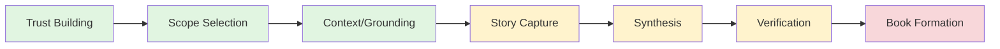

---

## 2. System Architecture Overview

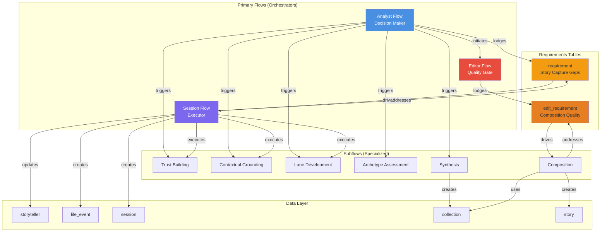

---

## 3. Core Execution Pattern: Analyst Runs ALL Subflows

```mermaid
flowchart TB
    START[Trigger Event:<br/>- storyteller_created<br/>- requirement_submission<br/>- session_completion<br/>- periodic check] --> ANALYST[Analyst Flow<br/>Triggered]

    ANALYST --> RUN[Run ALL Subflows<br/>in Sequence]

    RUN --> SF1[Trust Building]
    SF1 --> GATE1{Entry<br/>Criteria?}
    GATE1 -->|phase IN<br/>[NULL, trust_building]| EXEC1[✓ Execute:<br/>Assess & Create<br/>Requirements]
    GATE1 -->|Other| SKIP1[✗ Return Early]
    EXEC1 --> SF2
    SKIP1 --> SF2

    SF2[Contextual Grounding]
    SF2 --> GATE2{Entry<br/>Criteria?}
    GATE2 -->|phase =<br/>history_building| EXEC2[✓ Execute]
    GATE2 -->|Other| SKIP2[✗ Return Early]
    EXEC2 --> SF3
    SKIP2 --> SF3

    SF3[Section Selection]
    SF3 --> GATE3{Entry<br/>Criteria?}
    GATE3 -->|history_building<br/>AND grounding_complete| EXEC3[✓ Execute]
    GATE3 -->|Other| SKIP3[✗ Return Early]
    EXEC3 --> SF4
    SKIP3 --> SF4

    SF4[Lane Development]
    SF4 --> GATE4{Entry<br/>Criteria?}
    GATE4 -->|story_capture<br/>AND sections_selected| EXEC4[✓ Execute]
    GATE4 -->|Other| SKIP4[✗ Return Early]
    EXEC4 --> SF5
    SKIP4 --> SF5

    SF5[Archetype Assessment]
    SF5 --> GATE5{Entry<br/>Criteria?}
    GATE5 -->|story_capture<br/>AND session_count >= 4<br/>AND count % 3 = 0| EXEC5[✓ Execute]
    GATE5 -->|Other| SKIP5[✗ Return Early]
    EXEC5 --> SF6
    SKIP5 --> SF6

    SF6[Synthesis]
    SF6 --> GATE6{Entry<br/>Criteria?}
    GATE6 -->|story_capture<br/>AND sufficient_material| EXEC6[✓ Execute]
    GATE6 -->|Other| SKIP6[✗ Return Early]
    EXEC6 --> SF7
    SKIP6 --> SF7

    SF7[Composition]
    SF7 --> GATE7{Entry<br/>Criteria?}
    GATE7 -->|All sufficiency<br/>gates passed| EXEC7[✓ Execute]
    GATE7 -->|Other| SKIP7[✗ Return Early]
    EXEC7 --> SF8
    SKIP7 --> SF8

    SF8[Editor]
    SF8 --> GATE8{Entry<br/>Criteria?}
    GATE8 -->|story_exists<br/>AND chapters_created| EXEC8[✓ Execute]
    GATE8 -->|Other| SKIP8[✗ Return Early]
    EXEC8 --> COMPLETE
    SKIP8 --> COMPLETE

    COMPLETE[All Subflows<br/>Complete] --> DETERMINE[Determine<br/>Next Action]

    DETERMINE --> ACTION{State<br/>After All<br/>Subflows?}
    ACTION -->|Pending<br/>Requirements| SESSION[Schedule/Continue<br/>Session]
    ACTION -->|No Requirements<br/>+ Complete| EXPORT[Story Ready]
    ACTION -->|No Requirements<br/>+ Incomplete| REVIEW[Review Needed]

    SESSION --> VAPI[VAPI Session]
    VAPI --> SUBMIT[submit_requirement_result]
    SUBMIT --> RETRIGGER[Trigger Analyst<br/>IMMEDIATELY]
    RETRIGGER -.->|Loop| ANALYST

    style ANALYST fill:#3498db,color:#fff
    style RUN fill:#4a90e2,color:#fff
    style EXEC1 fill:#27ae60,color:#fff
    style EXEC2 fill:#27ae60,color:#fff
    style EXEC3 fill:#27ae60,color:#fff
    style EXEC4 fill:#27ae60,color:#fff
    style EXEC5 fill:#27ae60,color:#fff
    style EXEC6 fill:#27ae60,color:#fff
    style EXEC7 fill:#27ae60,color:#fff
    style EXEC8 fill:#27ae60,color:#fff
    style SKIP1 fill:#95a5a6
    style SKIP2 fill:#95a5a6
    style SKIP3 fill:#95a5a6
    style SKIP4 fill:#95a5a6
    style SKIP5 fill:#95a5a6
    style SKIP6 fill:#95a5a6
    style SKIP7 fill:#95a5a6
    style SKIP8 fill:#95a5a6
    style SUBMIT fill:#e74c3c,color:#fff
    style RETRIGGER fill:#e67e22,color:#fff
```

**Key Principles:**
1. **Analyst ALWAYS runs ALL subflows** - No selective execution
2. **Each subflow self-gates** - Checks entry criteria and returns early if not met
3. **Analyst runs after EVERY requirement submission** - Real-time response
4. **Deterministic & predictable** - Same sequence every time, state determines behavior

---

## 4. Real-Time Requirement Submission Flow

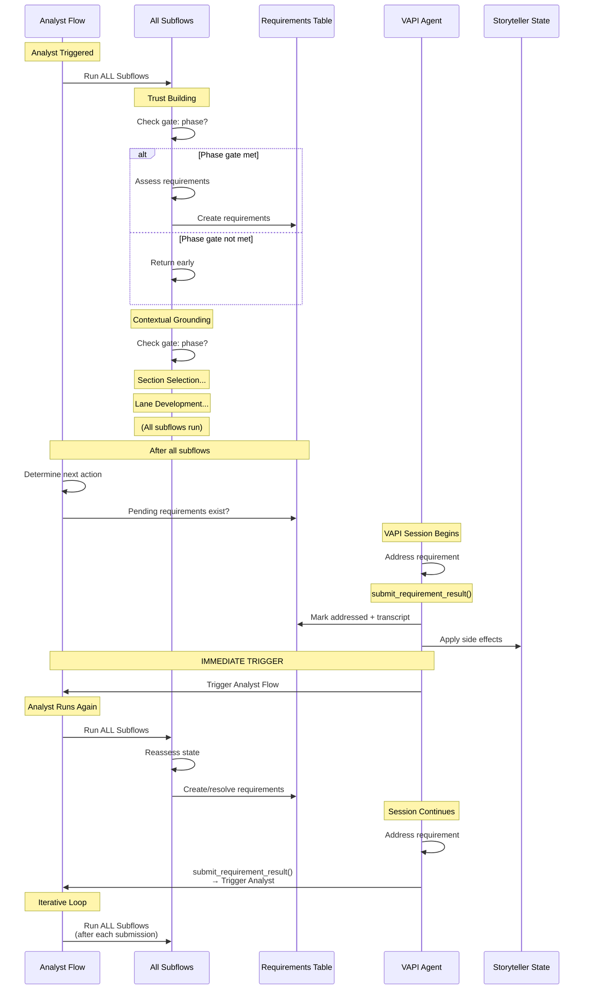

---

## 5. Pattern 2: Editor → Composition → Editor Loop

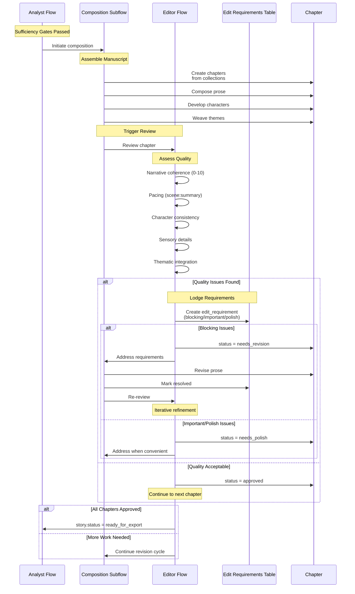

---

## 6. Pattern 3: Multi-Archetype Refinement (Progressive Narrowing)

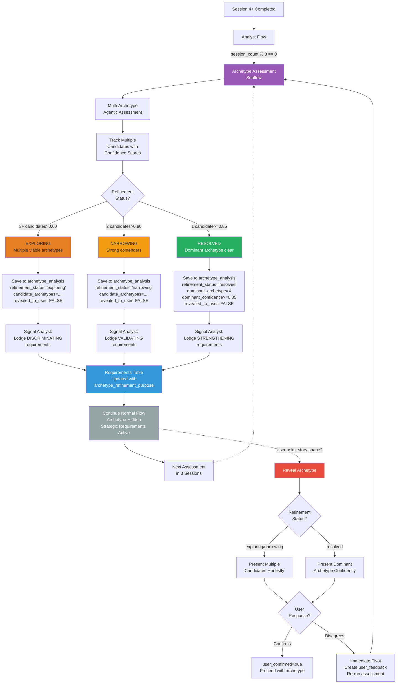

---

## 7. Session Flow: Complete Lifecycle

```mermaid
graph TB
    START[Session Triggered] --> PREP[Phase 1: Pre-Call<br/>Preparation]

    PREP --> P1[Load Storyteller State]
    P1 --> P2[Determine Session Goal]
    P2 --> P3[Load Requirements]
    P3 --> P4[Pre-load Story Context]
    P4 --> P5[Generate Prompts]
    P5 --> P6[Create VAPI Agent]
    P6 --> EXEC[Phase 2: Call<br/>Execution]

    EXEC --> E1[VAPI Initiates Call]
    E1 --> E2[Agent Conducts Interview]
    E2 --> E3[Real-time Transcript<br/>Streaming]
    E3 --> E4[Call End]
    E4 --> E5[end_call_report<br/>Received]
    E5 --> QUAL[Phase 3: Quality<br/>Validation]

    QUAL --> Q1{Quality<br/>Issues?}
    Q1 -->|Yes| FAIL[Notify User<br/>Offer Reschedule]
    Q1 -->|No| PROC[Phase 4: Post-Call<br/>Processing]

    PROC --> PR1[Persist Transcript]
    PR1 --> PR2[Extract Story Points]
    PR2 --> PR3[Create/Update<br/>Life Events]
    PR3 --> PR4[Create Session<br/>Artifacts]
    PR4 --> PR5[Update Section<br/>Progress]
    PR5 --> VERIFY[Phase 5: User<br/>Verification]

    VERIFY --> V1[Generate Session<br/>Summary]
    V1 --> V2[Send to User]
    V2 --> V3{User<br/>Response?}
    V3 -->|Approved| TRIG[Phase 6: Trigger<br/>Next Steps]
    V3 -->|Changes| UPDATE[Update Story<br/>Points]
    V3 -->|Redo| REDO[Schedule New<br/>Session]

    UPDATE --> TRIG

    TRIG --> T1[Update Storyteller<br/>Progress]
    T1 --> T2[Mark Requirements<br/>Addressed]
    T2 --> T3[Trigger Analyst<br/>Flow]
    T3 --> T4[Offer Next Session<br/>Scheduling]
    T4 --> END[Session Complete]

    FAIL --> END
    REDO --> END

    style PREP fill:#3498db,color:#fff
    style EXEC fill:#9b59b6,color:#fff
    style QUAL fill:#e67e22,color:#fff
    style PROC fill:#27ae60,color:#fff
    style VERIFY fill:#f39c12,color:#fff
    style TRIG fill:#e74c3c,color:#fff
```

---

## 8. Analyst Flow: All Subflows Execution Pattern

```mermaid
flowchart TD
    START[Analyst Flow<br/>Triggered] --> LOAD[Load Storyteller<br/>State]

    LOAD --> RUN[Run ALL Subflows<br/>Sequentially]

    RUN --> SF1[1. Trust Building<br/>Workflow]
    SF1 --> G1{Phase gate?}
    G1 -->|NULL or trust_building| EX1[Execute:<br/>Assess requirements<br/>Create/resolve<br/>Transition if complete]
    G1 -->|Other phase| SKIP1[Return early:<br/>gate not met]
    EX1 --> SF2
    SKIP1 --> SF2

    SF2[2. Contextual Grounding<br/>Workflow]
    SF2 --> G2{Phase gate?}
    G2 -->|history_building| EX2[Execute:<br/>Assess timeline anchors<br/>Create requirements]
    G2 -->|Other phase| SKIP2[Return early:<br/>gate not met]
    EX2 --> SF3
    SKIP2 --> SF3

    SF3[3. Section Selection<br/>Workflow]
    SF3 --> G3{Phase gate?}
    G3 -->|history_building AND<br/>contextual_grounding_complete| EX3[Execute:<br/>Create section<br/>selection requirement]
    G3 -->|Gates not met| SKIP3[Return early]
    EX3 --> SF4
    SKIP3 --> SF4

    SF4[4. Lane Development<br/>Workflow]
    SF4 --> G4{Phase gate?}
    G4 -->|story_capture AND<br/>sections_selected| EX4[Execute:<br/>Analyze gaps<br/>Lodge requirements]
    G4 -->|Gates not met| SKIP4[Return early]
    EX4 --> SF5
    SKIP4 --> SF5

    SF5[5. Archetype Assessment<br/>Workflow]
    SF5 --> G5{Phase gate?}
    G5 -->|story_capture AND<br/>session_count >= 4 AND<br/>session_count % 3 == 0| EX5[Execute:<br/>Multi-archetype analysis<br/>Lodge refinement requirements]
    G5 -->|Gates not met| SKIP5[Return early]
    EX5 --> SF6
    SKIP5 --> SF6

    SF6[6. Synthesis<br/>Workflow]
    SF6 --> G6{Material gate?}
    G6 -->|story_capture AND<br/>section has sufficient material| EX6[Execute:<br/>Create provisional draft<br/>Assemble collection]
    G6 -->|Gates not met| SKIP6[Return early]
    EX6 --> SF7
    SKIP6 --> SF7

    SF7[7. Composition<br/>Workflow]
    SF7 --> G7{Sufficiency gates?}
    G7 -->|All gates passed:<br/>archetype resolved<br/>material threshold<br/>character dev<br/>thematic coherence| EX7[Execute:<br/>Create chapters<br/>Compose prose]
    G7 -->|Gates not met| SKIP7[Return early]
    EX7 --> SF8
    SKIP7 --> SF8

    SF8[8. Editor<br/>Workflow]
    SF8 --> G8{Story exists?}
    G8 -->|story_exists AND<br/>chapters_created| EX8[Execute:<br/>Quality assessment<br/>Lodge edit requirements]
    G8 -->|Gates not met| SKIP8[Return early]
    EX8 --> DETERMINE
    SKIP8 --> DETERMINE

    DETERMINE[Determine Next Action<br/>Based on State]
    DETERMINE --> ACTION{State?}
    ACTION -->|Pending requirements| SCHED[Schedule/Continue<br/>Session]
    ACTION -->|No pending + complete| EXPORT[Story Complete]
    ACTION -->|No pending + not complete| REVIEW[Review Needed]

    SCHED --> OUTPUT[Output:<br/>Next Action]
    EXPORT --> OUTPUT
    REVIEW --> OUTPUT

    style START fill:#3498db,color:#fff
    style RUN fill:#4a90e2,color:#fff
    style EX1 fill:#27ae60,color:#fff
    style EX2 fill:#27ae60,color:#fff
    style EX3 fill:#27ae60,color:#fff
    style EX4 fill:#27ae60,color:#fff
    style EX5 fill:#27ae60,color:#fff
    style EX6 fill:#27ae60,color:#fff
    style EX7 fill:#27ae60,color:#fff
    style EX8 fill:#27ae60,color:#fff
    style SKIP1 fill:#95a5a6
    style SKIP2 fill:#95a5a6
    style SKIP3 fill:#95a5a6
    style SKIP4 fill:#95a5a6
    style SKIP5 fill:#95a5a6
    style SKIP6 fill:#95a5a6
    style SKIP7 fill:#95a5a6
    style SKIP8 fill:#95a5a6
    style OUTPUT fill:#e74c3c,color:#fff
```

---

## 9. Subflows: Trust Building Sequence

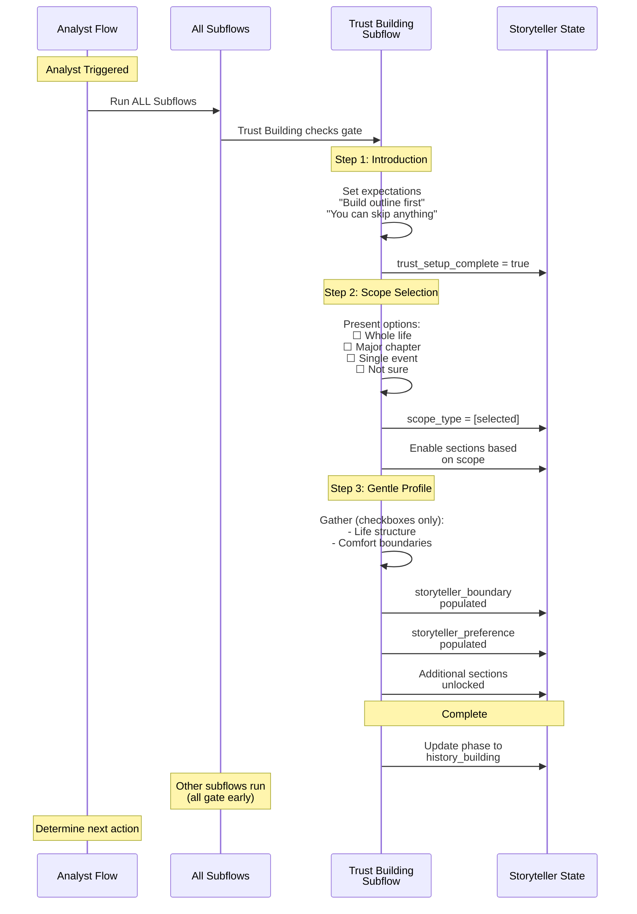

---

## 10. Subflows: Lane Development (The Engine)

```mermaid
flowchart TD
    START[Lane Development<br/>Triggered] --> INPUT[Input:<br/>Section Name<br/>Requirements]

    INPUT --> PROMPT[Apply Prompt Pack<br/>Template]

    PROMPT --> P1[Scene:<br/>Take me to a<br/>specific moment...]
    P1 --> P2[People:<br/>Who was there?]
    P2 --> P3[Tension:<br/>What was uncertain?]
    P3 --> P4[Change:<br/>Did anything shift?]
    P4 --> P5[Meaning:<br/>Looking back...]

    P5 --> BOUND{Check<br/>Boundaries}

    BOUND -->|Sensitive Topic| CHECK{User<br/>Comfortable?}
    CHECK -->|No| SKIP[Skip or<br/>Gentle Version]
    CHECK -->|Yes| ASK[Ask Prompt]
    BOUND -->|Safe Topic| ASK

    ASK --> RESP[Capture<br/>Response]
    RESP --> EXTRACT[Extract Material]

    EXTRACT --> EX1[Identify:<br/>scene vs summary]
    EX1 --> EX2[Extract:<br/>sensory details]
    EX2 --> EX3[Extract:<br/>emotions]
    EX3 --> EX4[Extract:<br/>people, places, time]
    EX4 --> EX5[Extract:<br/>tension, change]
    EX5 --> EX6[Extract:<br/>reflection, meaning]

    EX6 --> ART[Create<br/>session_artifact]
    ART --> EVENT[Update<br/>life_event]

    EVENT --> PROG[Track Progress]
    PROG --> PCT{Completion<br/>>= 80%?}

    PCT -->|Yes| DONE[Mark Section<br/>Completed]
    PCT -->|No| MORE{More<br/>Prompts?}

    MORE -->|Yes| P1
    MORE -->|No| DONE

    DONE --> UNLOCK[Check Dependent<br/>Sections]
    UNLOCK --> REQ[Mark Requirements<br/>Addressed]
    REQ --> TRIG[Trigger Analyst<br/>Flow]

    SKIP --> MORE

    style PROMPT fill:#3498db,color:#fff
    style EXTRACT fill:#9b59b6,color:#fff
    style ART fill:#27ae60,color:#fff
    style DONE fill:#e74c3c,color:#fff
```

---

## 11. Requirements Workflow: Story Capture (Real-Time)

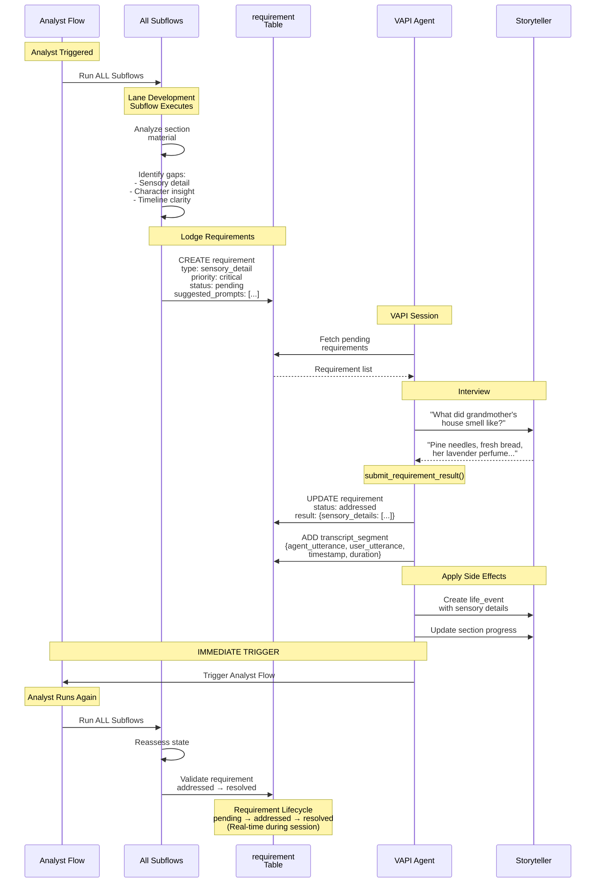

---

## 12. Requirements Workflow: Composition Quality

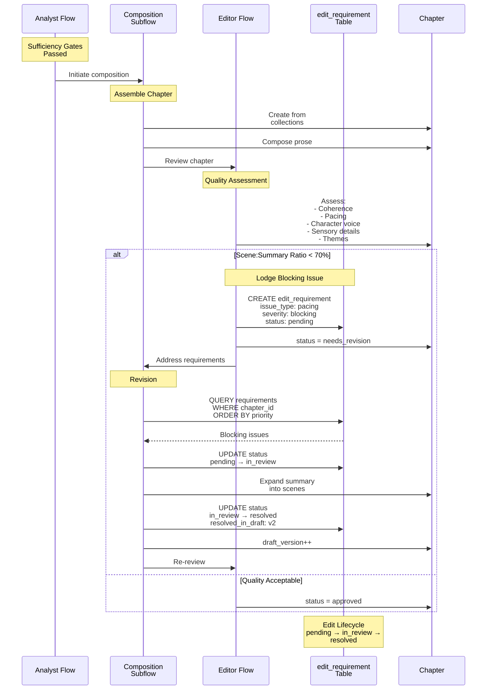

---

## 13. Data Flow: Complete Journey

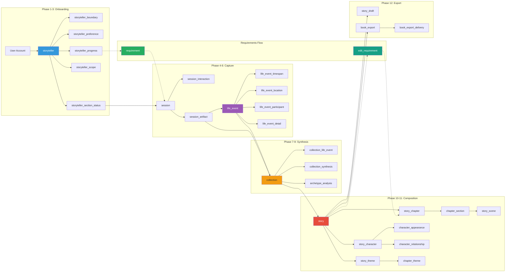

---

## 14. Implementation Phases

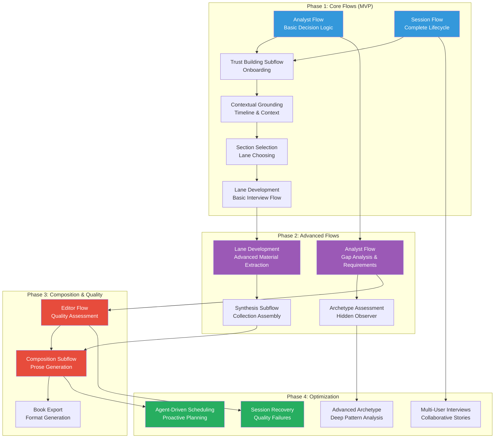

---

## 15. Progressive Section Unlocking

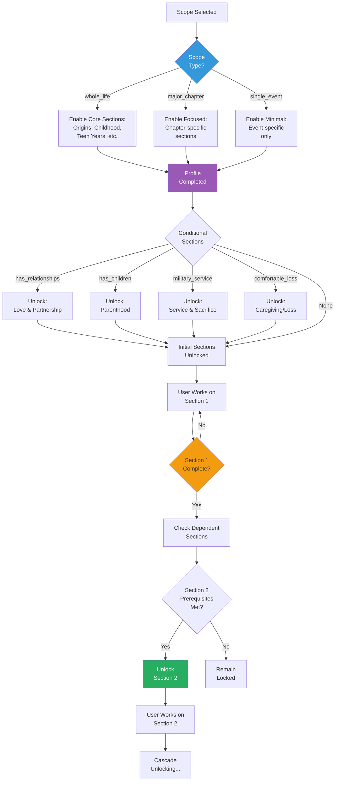

---

## 16. State Transitions

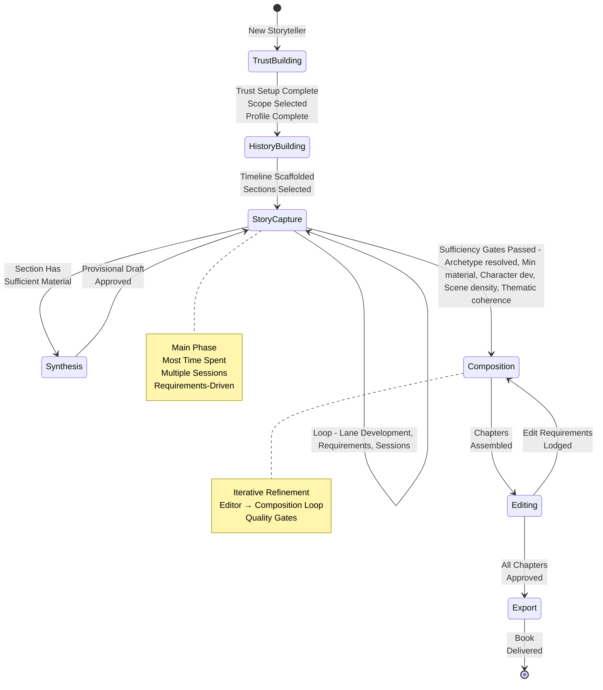

---

## Usage Notes

### Viewing Mermaid Diagrams

These diagrams can be viewed in:
- **GitHub**: Native Mermaid rendering
- **VS Code**: With Mermaid Preview extension
- **Mermaid Live Editor**: https://mermaid.live
- **Documentation sites**: GitBook, MkDocs, etc.

### Diagram Types Used

- **Flowchart** (`flowchart` / `graph`): For process flows and decision trees
- **Sequence Diagram** (`sequenceDiagram`): For interactions between flows
- **State Diagram** (`stateDiagram-v2`): For state transitions
- **Gantt Chart** (`gantt`): For implementation timeline

### Color Coding

- **Blue** (#3498db): Primary/orchestrator flows
- **Purple** (#9b59b6): Execution/processing
- **Orange** (#f39c12): Requirements/tracking
- **Red** (#e74c3c): Quality gates/critical points
- **Green** (#27ae60): Success/completion states
- **Gray** (#95a5a6): Hidden/background processes
