# Flow Architecture: Mermaid Diagrams

Visual representations of the Everbound flow architecture defined in [flow_architecture.md](flow_architecture.md).

---

## 1. Canonical Process Flow

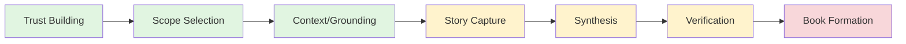

---

## 2. System Architecture Overview

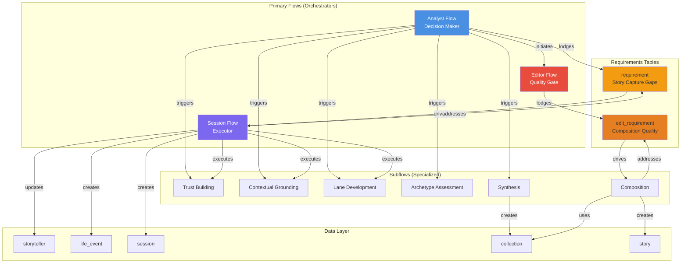

---

## 3. Pattern 1: Analyst → Session → Analyst Loop

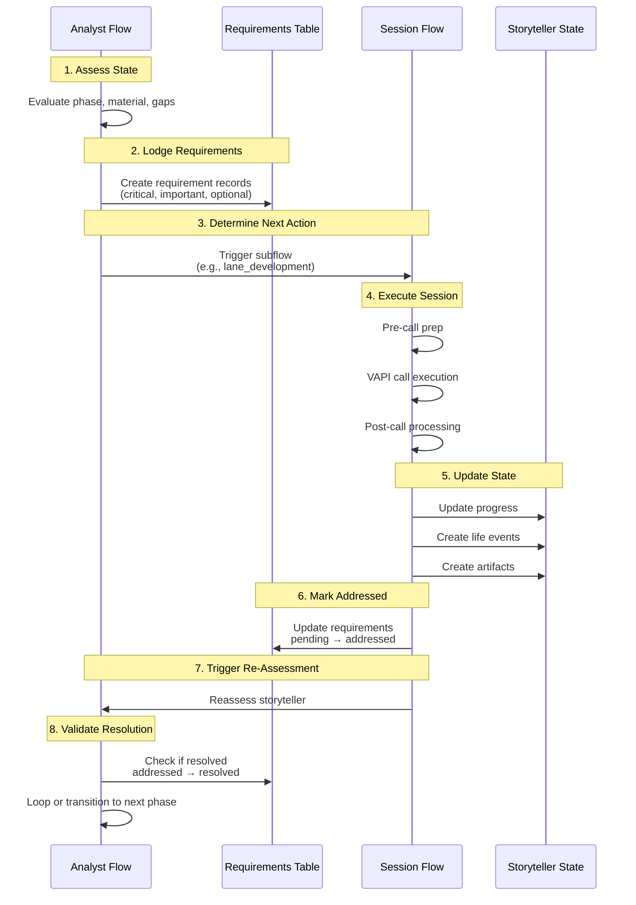

---

## 4. Pattern 2: Editor → Composition → Editor Loop

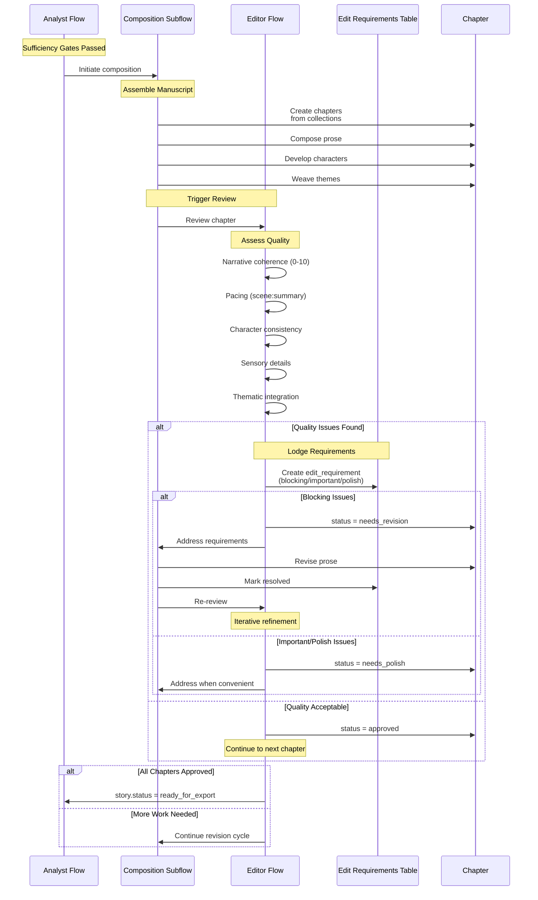

---

## 5. Pattern 3: Multi-Archetype Refinement (Progressive Narrowing)

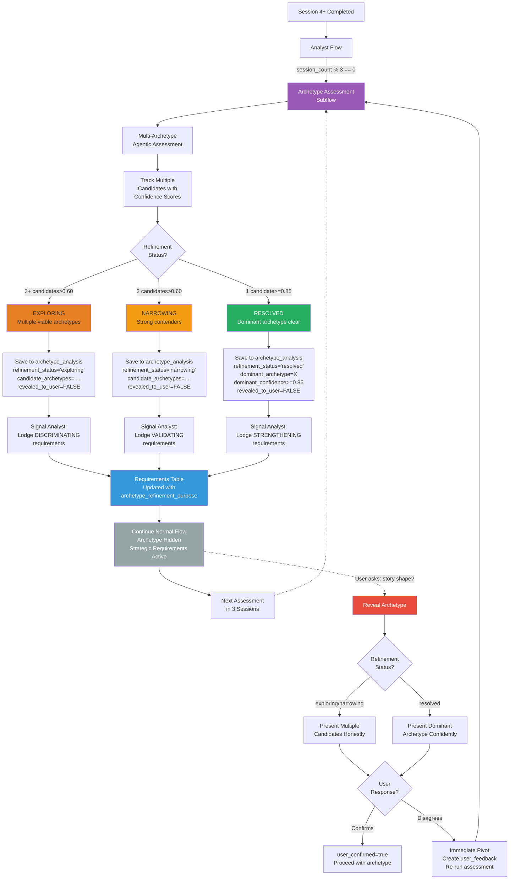

---

## 6. Session Flow: Complete Lifecycle

```mermaid
graph TB
    START[Session Triggered] --> PREP[Phase 1: Pre-Call<br/>Preparation]

    PREP --> P1[Load Storyteller State]
    P1 --> P2[Determine Session Goal]
    P2 --> P3[Load Requirements]
    P3 --> P4[Pre-load Story Context]
    P4 --> P5[Generate Prompts]
    P5 --> P6[Create VAPI Agent]
    P6 --> EXEC[Phase 2: Call<br/>Execution]

    EXEC --> E1[VAPI Initiates Call]
    E1 --> E2[Agent Conducts Interview]
    E2 --> E3[Real-time Transcript<br/>Streaming]
    E3 --> E4[Call End]
    E4 --> E5[end_call_report<br/>Received]
    E5 --> QUAL[Phase 3: Quality<br/>Validation]

    QUAL --> Q1{Quality<br/>Issues?}
    Q1 -->|Yes| FAIL[Notify User<br/>Offer Reschedule]
    Q1 -->|No| PROC[Phase 4: Post-Call<br/>Processing]

    PROC --> PR1[Persist Transcript]
    PR1 --> PR2[Extract Story Points]
    PR2 --> PR3[Create/Update<br/>Life Events]
    PR3 --> PR4[Create Session<br/>Artifacts]
    PR4 --> PR5[Update Section<br/>Progress]
    PR5 --> VERIFY[Phase 5: User<br/>Verification]

    VERIFY --> V1[Generate Session<br/>Summary]
    V1 --> V2[Send to User]
    V2 --> V3{User<br/>Response?}
    V3 -->|Approved| TRIG[Phase 6: Trigger<br/>Next Steps]
    V3 -->|Changes| UPDATE[Update Story<br/>Points]
    V3 -->|Redo| REDO[Schedule New<br/>Session]

    UPDATE --> TRIG

    TRIG --> T1[Update Storyteller<br/>Progress]
    T1 --> T2[Mark Requirements<br/>Addressed]
    T2 --> T3[Trigger Analyst<br/>Flow]
    T3 --> T4[Offer Next Session<br/>Scheduling]
    T4 --> END[Session Complete]

    FAIL --> END
    REDO --> END

    style PREP fill:#3498db,color:#fff
    style EXEC fill:#9b59b6,color:#fff
    style QUAL fill:#e67e22,color:#fff
    style PROC fill:#27ae60,color:#fff
    style VERIFY fill:#f39c12,color:#fff
    style TRIG fill:#e74c3c,color:#fff
```

---

## 7. Analyst Flow: Decision Logic

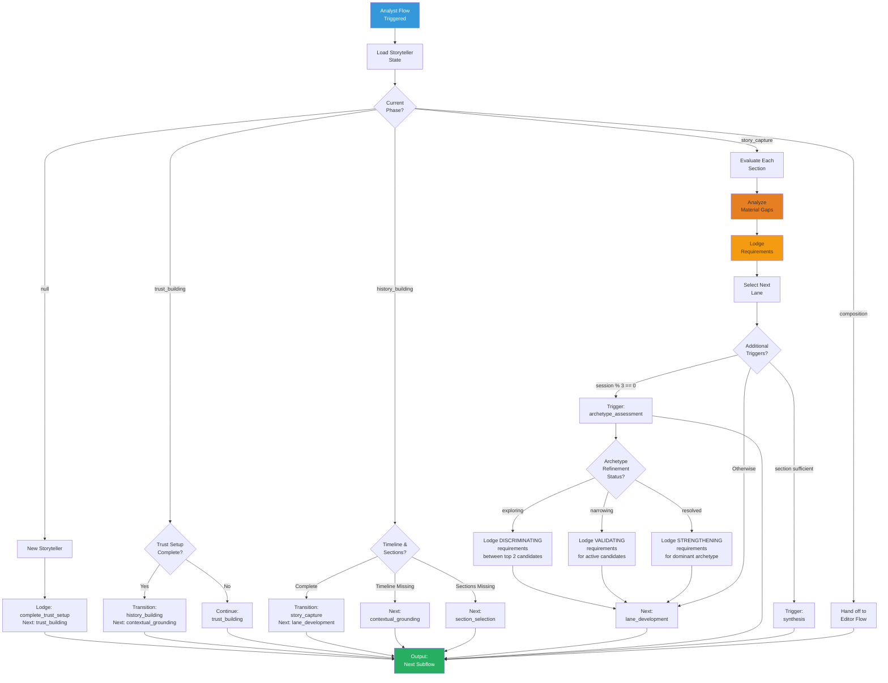

---

## 8. Subflows: Trust Building Sequence

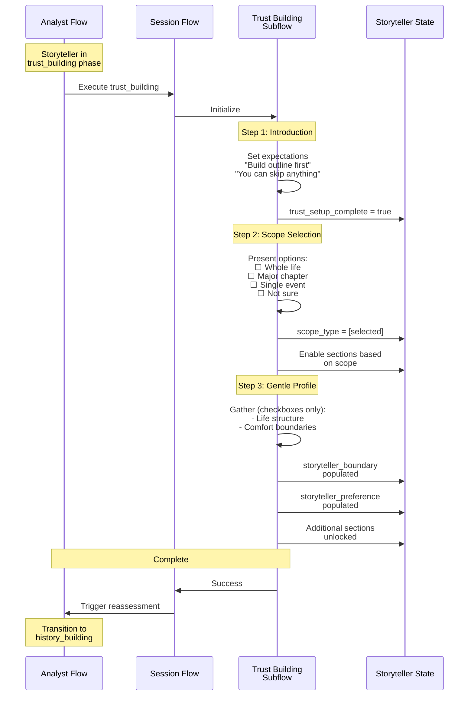

---

## 9. Subflows: Lane Development (The Engine)

```mermaid
flowchart TD
    START[Lane Development<br/>Triggered] --> INPUT[Input:<br/>Section Name<br/>Requirements]

    INPUT --> PROMPT[Apply Prompt Pack<br/>Template]

    PROMPT --> P1[Scene:<br/>Take me to a<br/>specific moment...]
    P1 --> P2[People:<br/>Who was there?]
    P2 --> P3[Tension:<br/>What was uncertain?]
    P3 --> P4[Change:<br/>Did anything shift?]
    P4 --> P5[Meaning:<br/>Looking back...]

    P5 --> BOUND{Check<br/>Boundaries}

    BOUND -->|Sensitive Topic| CHECK{User<br/>Comfortable?}
    CHECK -->|No| SKIP[Skip or<br/>Gentle Version]
    CHECK -->|Yes| ASK[Ask Prompt]
    BOUND -->|Safe Topic| ASK

    ASK --> RESP[Capture<br/>Response]
    RESP --> EXTRACT[Extract Material]

    EXTRACT --> EX1[Identify:<br/>scene vs summary]
    EX1 --> EX2[Extract:<br/>sensory details]
    EX2 --> EX3[Extract:<br/>emotions]
    EX3 --> EX4[Extract:<br/>people, places, time]
    EX4 --> EX5[Extract:<br/>tension, change]
    EX5 --> EX6[Extract:<br/>reflection, meaning]

    EX6 --> ART[Create<br/>session_artifact]
    ART --> EVENT[Update<br/>life_event]

    EVENT --> PROG[Track Progress]
    PROG --> PCT{Completion<br/>>= 80%?}

    PCT -->|Yes| DONE[Mark Section<br/>Completed]
    PCT -->|No| MORE{More<br/>Prompts?}

    MORE -->|Yes| P1
    MORE -->|No| DONE

    DONE --> UNLOCK[Check Dependent<br/>Sections]
    UNLOCK --> REQ[Mark Requirements<br/>Addressed]
    REQ --> TRIG[Trigger Analyst<br/>Flow]

    SKIP --> MORE

    style PROMPT fill:#3498db,color:#fff
    style EXTRACT fill:#9b59b6,color:#fff
    style ART fill:#27ae60,color:#fff
    style DONE fill:#e74c3c,color:#fff
```

---

## 10. Requirements Workflow: Story Capture

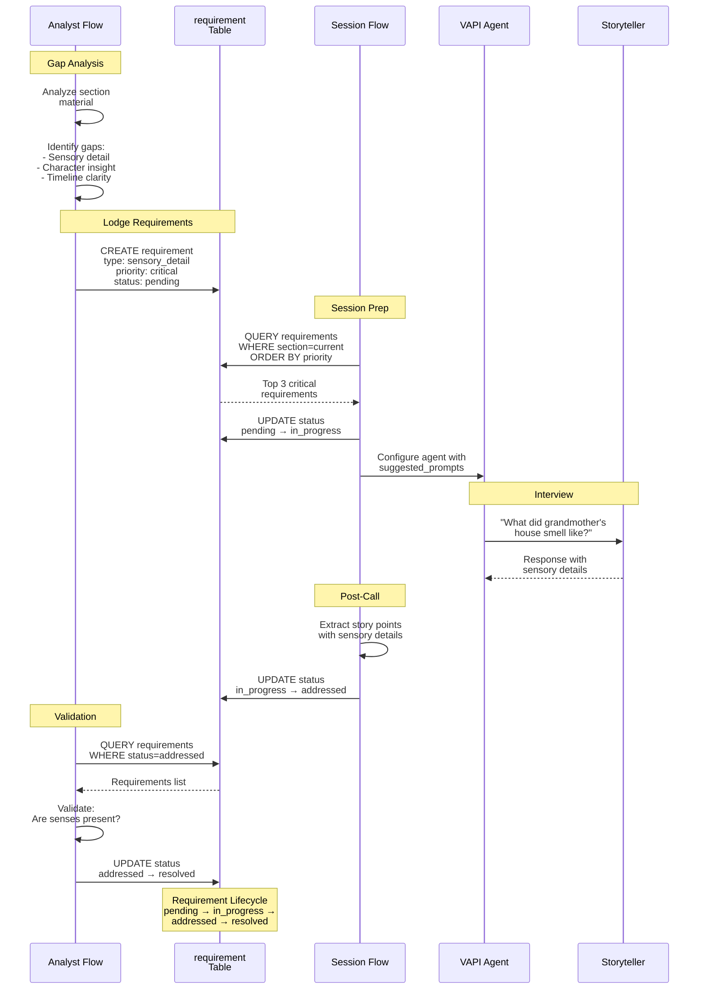

---

## 11. Requirements Workflow: Composition Quality

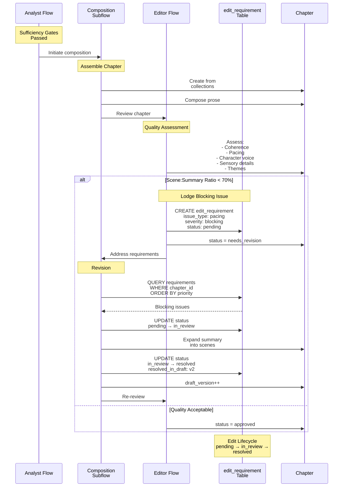

---

## 12. Data Flow: Complete Journey

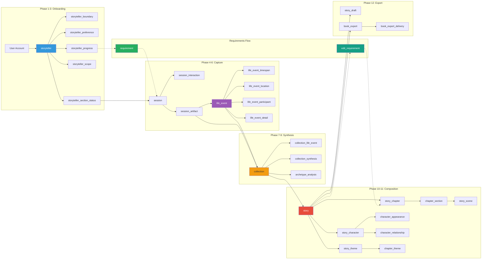

---

## 13. Implementation Phases

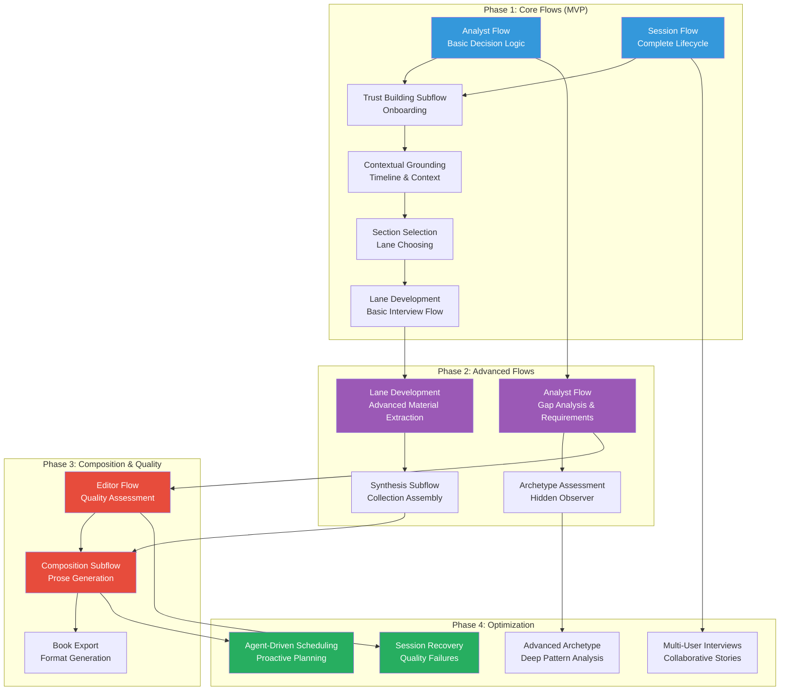

---

## 14. Progressive Section Unlocking

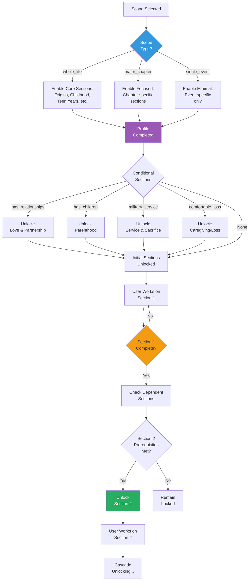

---

## 15. State Transitions

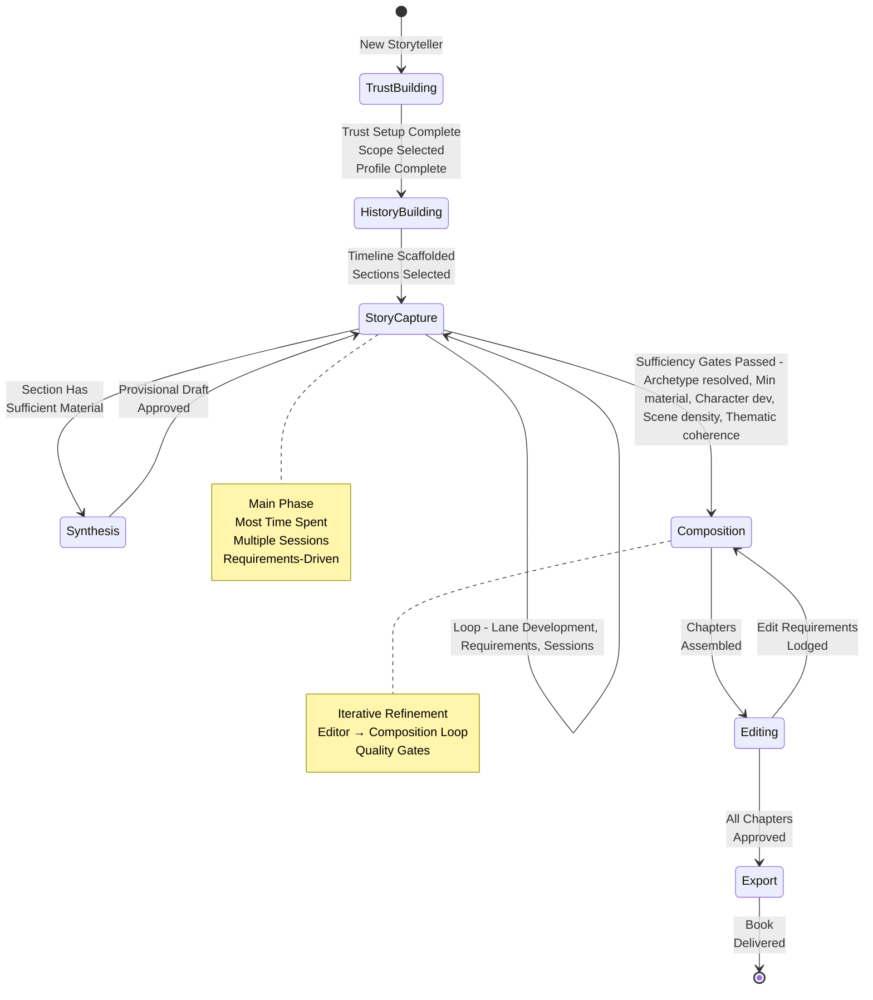

---

## Usage Notes

### Viewing Mermaid Diagrams

These diagrams can be viewed in:
- **GitHub**: Native Mermaid rendering
- **VS Code**: With Mermaid Preview extension
- **Mermaid Live Editor**: https://mermaid.live
- **Documentation sites**: GitBook, MkDocs, etc.

### Diagram Types Used

- **Flowchart** (`flowchart` / `graph`): For process flows and decision trees
- **Sequence Diagram** (`sequenceDiagram`): For interactions between flows
- **State Diagram** (`stateDiagram-v2`): For state transitions
- **Gantt Chart** (`gantt`): For implementation timeline

### Color Coding

- **Blue** (#3498db): Primary/orchestrator flows
- **Purple** (#9b59b6): Execution/processing
- **Orange** (#f39c12): Requirements/tracking
- **Red** (#e74c3c): Quality gates/critical points
- **Green** (#27ae60): Success/completion states
- **Gray** (#95a5a6): Hidden/background processes
